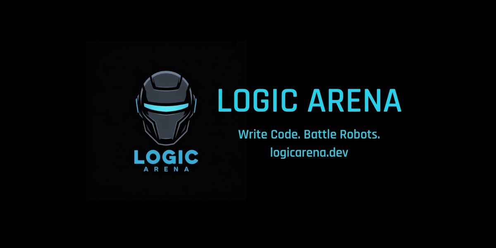

<div align="center">



# ⚔️ LOGIC ARENA ⚔️
**v3.6.5 | Program your robot. Outsmart your opponent. Dominate the arena.**

[](https://www.typescriptlang.org/)
[](https://nextjs.org/)
[](https://nestjs.com/)
[](https://threejs.org/)
[](https://www.prisma.io/)
[](https://socket.io/)
[](https://github.com/Ali-Haggag7/logic-arena/packages)
[](https://logicarena.dev)

[**Live Demo (v3.6.5)**](https://logicarena.dev) · [**Documentation**](#project-documentation) · [**Report Bug**](https://github.com/Ali-Haggag7/logic-arena/issues)

</div>

---

## 🧠 What is Logic Arena?

Logic Arena is a **competitive coding platform** where developers write scripts in **AliScript** — a custom domain-specific language — to control autonomous robots that battle in a physics-driven 3D arena. Think LeetCode meets StarCraft.

> *"The best robot isn't the fastest — it's the most intelligent."*

Unlike traditional games, **you don't play Logic Arena with a keyboard or a gamepad**. You program your robot's behavior before the match, and watch your logic execute in real-time against opponents. Every win is a proof of your algorithmic thinking.

---

## 🌟 The Intelligent Arena Update (v3.6.5)

The latest release expands solo training and stabilizes guest arena sessions:
* **Practice vs AI:** authenticated players can battle automated bots across Combat, Capture the Flag, King of the Hill, Survival, and Racing with Easy, Medium, and Hard difficulty tiers.
* **Bot script library:** `packages/engine/src/ai-scripts.ts` ships 15 flat-format AI scripts. Easy bots use basic movement and firing; Hard bots add predictive targeting, shields, strafing, and `lockVision`.
* **Authoritative AI rewards:** `apps/server/src/modules/matches/ai-points.ts` calculates mode-specific rewards, then applies difficulty multipliers (Easy = 1x, Medium = 2x, Hard = 3x). Solo testing without a difficulty flag earns zero points.
* **Guest match stats:** guest victory and defeat overlays now use live engine stats such as accuracy, impacts, movement speed, and duration, but keep them temporary in viewport memory with no database writes.
* **Arena stability:** guest join timing now uses guarded `joinMatch` emission checkpoints, while the 3D renderer separates live raw vectors from interpolation caches and memoizes Canvas configuration to prevent WebGL context churn.
* **Campaign continuity:** v3.6 also keeps server-side campaign pause/resume, temporary campaign replay controls, synchronized `CAMPAIGN_MATCH_MAX_STEPS`, and the shared `@logic-arena/engine/constants` export.

---

## ⚔️ Gameplay Types

|  |  |  |
| :---: | :---: | :---: |
| **Tactical Mode**<br>The ultimate test of rapid adaptation. | **Classic Mode**<br>Strategic Token Budget resource management. | **Hybrid Mode**<br>Pure chaotic algorithmic deathmatch. |

## 🗺️ Battle Environments

|  |  |  |
| :---: | :---: | :---: |
| **Cyber City** | **Glacial Tundra** | **Volcanic Core** |

## 🎯 Game Modes

|  |  |  |
| :---: | :---: | :---: |
| **Combat**<br>Head-to-head duel. | **Capture The Flag**<br>Team coordination. | **King of the Hill**<br>Area control mechanics. |

|  |  |  |
| :---: | :---: | :---: |
| **Survival**<br>Endless NPC waves. | **Racing**<br>Waypoint navigation. | **Training**<br>Sandbox testing. |

---

## 🤖 The Garage: Custom AAA Chassis

Unlock and equip unique custom robot chassis models in the **Black Market (Vault)** using earned progression currency.

|  |  |  |  |
| :---: | :---: | :---: | :---: |
| **TITAN Heavy Armor** | **SANDMAN Specialist** | **UNIT-01 Vanguard** | **UNIT-02 Phantom** |

---

## ✨ Core Features

### 💻 AliScript v3 — Custom Combat Language
Write robot behavior scripts using Logic Arena's custom language. Supports **Dictionaries, State Machines, Dot Notation**, advanced sensory arrays, and **Swarm Intelligence** via a secure broadcast protocol. Strict server-side execution sandboxing limits script size, logic timeouts (TLE quotas), whitelisted commands, and applies execution rate limiting. Mobile players can use the intuitive **Block Editor** to drag and drop logic instead of typing code.

### ⚡ Real-Time Physics, FOV, and Super Powers
Features vector-based physics, collision detection, and projectile simulations with fixed-step simulation and real-time WebSocket frame streaming. Equip **Tactical Super Powers** like SHIELD, CLOAK, DASH, TELEPORT, MINE, or TAUNT to turn the tide. All tactical choices consume points through a robust Energy & STASIS system.

### 🎮 Campaign Battles, Pause, and Replay
The 60-level campaign streams authoritative server frames directly to the client. Campaign fights can be paused and resumed through server-owned session state, and finished fights expose a temporary replay scrubber for reviewing the exact frames that led to victory, defeat, or draw. Victory modals count points and stars immediately while preserving the user's best-star record.

### 🤖 Practice vs AI
Practice against first-party AI bots before entering ranked matches. Each game variant supports Easy, Medium, and Hard bot scripts, and authenticated AI wins can award server-calculated points based on the mode objective, final performance, and selected difficulty. Guest practice shows live match stats without writing leaderboard or progression records.

### 💼 Economy & Black Market
Earn progression through battles and campaigns, and spend your currency in the **Black Market (Vault)** to unlock custom paints, premium tracer rounds, and elite chassis models. Equip items using a high-fidelity 3D interactive viewer.

### 📱 PWA Support & Multi-Theme System
Toggle between Cyberpunk, Light, and Obsidian Ember themes. Fully Progressive Web App support ensures it's installable locally with offline pages, safe-area mapping, and a frictionless mobile-first dashboard experience featuring an exclusive Drag-and-Drop Block IDE.

### 🛡️ Enterprise-Grade Security
Built with a 4-Layer security architecture:
1. **Perimeter:** HttpOnly Cookies, Redis global & route-specific rate limiting.
2. **Database:** Prisma ORM payload protection and sanitization.
3. **Execution:** AliScript AST Sandbox hardening & memory TLE quotas.
4. **Frontend:** React XSS DOM protection.

---

## 🏗️ Architecture

Logic Arena is a **pnpm monorepo** with distinct decoupled packages:

```text
logic-arena/
├── apps/
│   ├── client/          # Next.js 16 — Frontend (App Router, PWA, R3F)
│   └── server/          # NestJS 11 — Backend API + WebSocket
└── packages/
    ├── engine/          # Shared Game Engine (TypeScript, 60 FPS Physics)
    └── logic-parser/    # AST Parser & AliScript Evaluator + Block Compiler
```

### Data Flow

```text
[Player writes AliScript v3 (Text or Blocks)] 
        ↓
[Client sends script via API payload]
        ↓
[Server parses & evaluates AST securely in Sandbox]
        ↓
[Game Engine: physics tick every 50ms]
        ↓
[State delta broadcast to Match Room + Spectators]
        ↓
[React Three Fiber renders the frame using Interpolation]
        ↓
[Snapshot saved to database / Redis every tick]
```

Campaign fights use a specialized server-side `CampaignSession` map. Each session owns its interval reference, `MatchEngine`, step count, logic counter, pause state, and replay frame stream. While paused, the session loop returns without advancing. On resume, wall-clock timestamps such as `Robot.hitWallTimestamp`, `Robot.shieldHitTimestamp`, and active mine `Obstacle.createdAt` are shifted by the paused duration so cooldowns and arming windows remain consistent.

### Tech Stack

| Layer | Technology |
|-------|-----------|
| Frontend | Next.js 16, React Three Fiber, Framer Motion, TailwindCSS, @dnd-kit |
| Backend | NestJS 11, Socket.io, JWT Auth, Cloudinary (Avatars), Nodemailer |
| Production / Scaling | Docker + Nginx, Redis (Upstash) for presence + rate limiting |
| Packages / Engine | Custom typescript physics engine, AST logic-parser |
| Database | PostgreSQL + Prisma ORM |
| PWA Integration | Service Worker, webmanifest |
| Monorepo | pnpm workspaces |

---

## 🚀 Getting Started

### Prerequisites
- Node.js 18+
- pnpm 8+
- PostgreSQL database
- Redis instance

### Installation
```bash
# Clone the repo
git clone https://github.com/Ali-Haggag7/logic-arena.git
cd logic-arena

# Install all dependencies
pnpm install

# Set up environment variables
cp apps/server/.env.example apps/server/.env
# Fill in DATABASE_URL, DIRECT_URL, JWT_SECRET, REDIS_URL, CLOUDINARY keys

# Database setup
cd apps/server
npx prisma db push
npx prisma generate
```

### Running the Project
```bash
# Start the full stack development environment synchronously
pnpm run dev:all
```
Open [http://localhost:3000](http://localhost:3000) — register an account and enter the arena.

---

## 🎮 How to Play

1. **Register** an account and log in.
2. Go to **Lobby** and challenge an opponent or join the **Campaign**.
3. Open the **Script Console** inside the arena (use the Block Editor on mobile!).
4. Write your AliScript strategy:

```text
IF GET_DISTANCE("enemy") < 400
  FIRE
END
IF ENEMY_HEALTH > MY_HEALTH
  USE_SHIELD
ELSE
  MOVE_FAST
END
```

5. Hit **EXECUTE** — your robot follows your logic in real-time.
6. Check the **Leaderboard** to track your global ranking and combat analytics.

---

## 📜 AliScript v3 Reference

| Category | Commands / Operators |
|----------|-------------|
| **Movement** | `MOVE`, `MOVE_FAST`, `BACKUP`, `STOP`, `PATHFIND` |
| **Actions** | `FIRE`, `BURST_FIRE`, `SCAN`, `WAIT` |
| **Abilities**| `USE_SHIELD`, `USE_CLOAK`, `USE_DASH`, `USE_TELEPORT`, `USE_MINE`, `USE_TAUNT` |
| **Variables/Data** | `SET`, Dictionaries (`state.mode = "attack"`), Arrays |
| **Control Flow** | `IF` / `ELSE` / `END`, `WHILE` / `DO` / `END`, `FOR` |
| **Logic/Operators** | `AND`, `OR`, `NOT`, `!=`, `<=`, `>=`, parentheses grouping |
| **Sensing** | `GET_DISTANCE()`, `GET_HEALTH()`, `GET_ENERGY()`, `RAYCAST()` |
| **Functions** | `FUNCTION`, `CALL` |
| **Swarm/Comms** | `BROADCAST`, `RECEIVE` |

---

## 📁 Project Documentation

| Document | Description |
|----------|-------------|
| [System Architecture](./docs/system-architecture.md) | Data flow, backend services, security model |
| [Script Sandboxing](./docs/script-sandboxing.md) | Server-side AST script isolation & TLE quotas |
| [ERD Diagram](./docs/erd-diagram.md) | Full PostgreSQL database schema |
| [Game Rules](./docs/game-rules.md) | Physics, combat, abilities, modes, Energy system |
| [Arena Environments & Modes](./docs/arena-environments-modes.md) | Arena themes, game modes, and play styles |
| [Folder Structure](./docs/folder-structure.md) | Monorepo layout and architectural conventions |
| [AliScript Language](./docs/aliscript-language.md) | Complete language syntax and reference guide |
| [Rotation System Guide](./docs/rotation-system-guide.md) | Deep dive into robot FOV and scanner mechanics |
| [Website Guide](./docs/website-guide.md) | Current page inventory and user-facing feature map |

---

<div align="center">

## 👨‍💻 Author

**Ali Haggag** — Computer Science Student, building the future of competitive programming education.

[](https://github.com/Ali-Haggag7)
[](mailto:ali.haggag2005@gmail.com)
[](https://www.linkedin.com/in/ali-haggag7/)
[](https://alihaggag.me/)

---

**Logic Arena** — *Where code becomes combat.*

⭐ Star this repo if it impressed you

</div>
