# Logic Arena — Arenas, Modes & Play Styles

> **Choose your battleground. Pick your rules. Command your robot.**

---

## Table of Contents

- [Environments (Themes)](#environments-themes)
  - [NEO-CYBER](#1-neo-cyber)
  - [MAGMA CORE](#2-magma-core)
  - [GLACIAL TUNDRA](#3-glacial-tundra)
- [Game Modes](#game-modes)
  - [COMBAT](#1-combat)
  - [TRAINING SOLO](#2-training-solo)
  - [RACING](#3-racing)
  - [SURVIVAL](#4-survival)
  - [KING OF THE HILL (KOTH)](#5-king-of-the-hill-koth)
  - [CAPTURE THE FLAG (CTF)](#6-capture-the-flag-ctf)
- [Play Styles](#play-styles)
  - [CLASSIC](#1-classic)
  - [TACTICAL](#2-tactical)
  - [HYBRID](#3-hybrid)
- [Quick Reference](#quick-reference)

---

## Environments (Themes)

Every arena in Logic Arena is an 800×600 grid — but the environment you fight in changes everything. Obstacles behave differently, visuals shift, and your AliScript must adapt.

---

### 1. NEO-CYBER

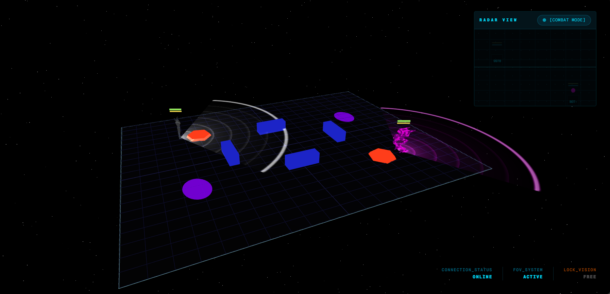

| Property | Detail |
|----------|--------|
| **Theme** | Cyberpunk / Neon |
| **Floor** | Dark grid with cyan accent lines |
| **Lighting** | High-contrast neon, deep shadows |
| **Obstacles** | Cyan-glowing SOLID walls, magenta TRAP zones, orange LAVA pools |
| **Atmosphere** | Rain particles, flickering neon signs, fog |

**The default arena.** NEO-CYBER is the original Logic Arena environment — a neon-drenched cyberpunk battleground where every obstacle is clearly visible and thematically consistent. All obstacle types (SOLID, TRAP, LAVA) render in their signature neon colors.

**Best for:** All modes. New players learning the ropes.

---

### 2. MAGMA CORE

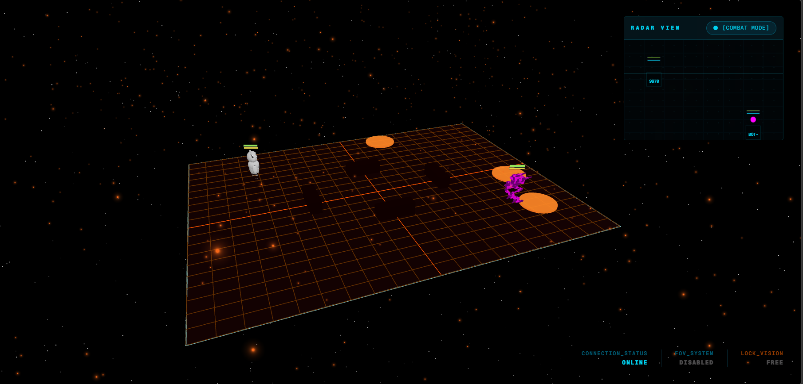

| Property | Detail |
|----------|--------|
| **Theme** | Volcanic / Lava |
| **Floor** | Cracked basalt with glowing orange fissures |
| **Lighting** | Warm amber glow, high contrast |
| **Obstacles** | Lava-colored SOLID walls, smoke TRAP zones, dynamic LAVA_POOL hazards |
| **Atmosphere** | Rising heat distortion, ember particles, low fog |

**The high-risk arena.** MAGMA CORE replaces the standard LAVA obstacles with dynamic `LAVA_POOL` entities that deal **10 HP/sec** — double the standard rate. The environment rewards aggressive play: get in, deal damage, and get out before the floor melts you.

**⚠️ Key difference:** Static LAVA obstacles from NEO-CYBER are removed here. Thematically consistent — only dynamic lava hazards exist. No double-damage stacking.

**Best for:** COMBAT, KOTH, SURVIVAL — modes where positioning matters.

---

### 3. GLACIAL TUNDRA

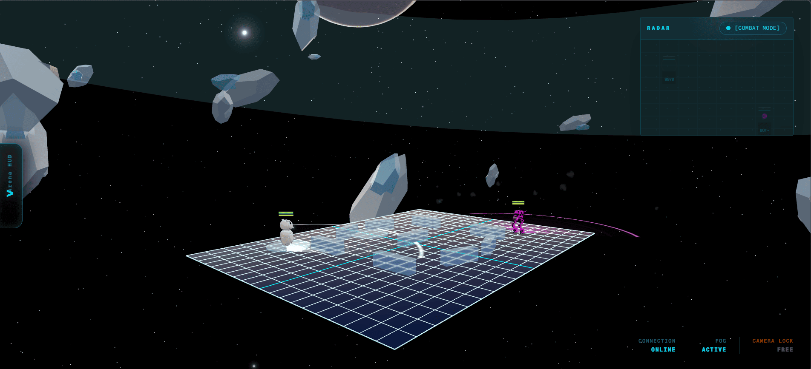

| Property | Detail |
|----------|--------|
| **Theme** | Arctic / Ice |
| **Floor** | Frozen lake with snow-covered edges |
| **Lighting** | Cool blue-white, low contrast |
| **Obstacles** | Ice-colored SOLID walls, frost TRAP zones, ICE_PATCH hazards |
| **Atmosphere** | Snowfall particles, mist, aurora borealis in skybox |

**The slippery arena.** GLACIAL TUNDRA introduces `ICE_PATCH` hazards — zones where friction drops to near zero. Robots entering an ICE_PATCH continue sliding in their current direction with minimal deceleration and severely reduced turning control. Your `SET rotation` commands still work (so you can aim your FOV cone), but MOVE direction is overridden by momentum.

**⚠️ Key difference:** FOV aiming (`_SYS_FACE_X/Y`) executes **before** the ice early return, so your turret and radar keep tracking targets even while your chassis slides uncontrollably.

**Best for:** RACING, COMBAT — modes where momentum management becomes a skill.

---

### Environment Comparison

| Feature | NEO-CYBER | MAGMA CORE | GLACIAL TUNDRA |
|---------|-----------|------------|----------------|
| Difficulty | ★☆☆ | ★★☆ | ★★★ |
| Lava damage | 5 HP/sec | 10 HP/sec | None |
| Ice patches | No | No | Yes |
| Visibility | High | Medium | Low (snow) |
| Movement penalty | None | None | Sliding |
| Recommended for | Beginners | Intermediates | Experts |

---

## Game Modes

Six distinct game modes. Different win conditions. Same AliScript.

---

### 1. COMBAT

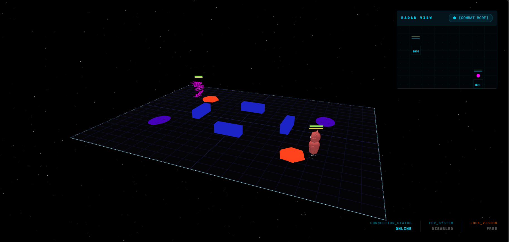

**Last robot standing.**

| Detail | Value |
|--------|-------|
| **Players** | 2–4 |
| **Win condition** | Be the last robot alive |
| **Time limit** | 3 minutes |
| **Tie-breaker** | Highest remaining health |
| **Energy regen** | 3/tick |

The classic. Deploy your AliScript and destroy all opponents. Combat mode tests the fundamentals: movement, targeting, resource management, and situational awareness.

**Strategy tips:**
- Balance `FIRE` and `SCAN` — firing blind wastes energy
- Use `PATHFIND` to navigate obstacles while focusing on combat
- Save energy for burst damage windows
- `SHIELD` before engaging, `DASH` to dodge incoming fire

---

### 2. TRAINING SOLO

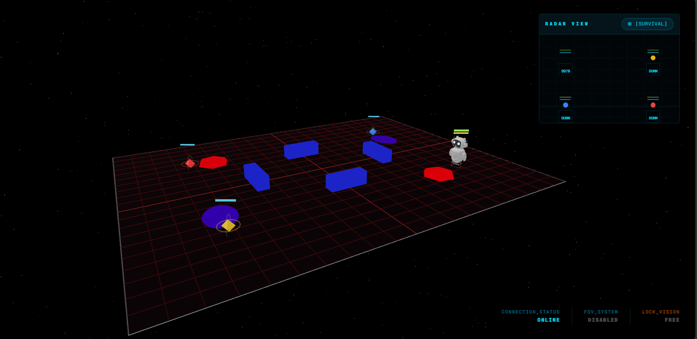

**Unlimited practice. No pressure.**

| Detail | Value |
|--------|-------|
| **Players** | 1 + holographic dummies |
| **Win condition** | None (infinite sandbox) |
| **Time limit** | None |
| **Respawn** | Manual — press RESPAWN DUMMIES |
| **HUD** | Session time, shots fired, accuracy %, damage dealt |

A zero-stakes sandbox where you can test your AliScript against holographic training dummies. Dummies have real health bars and can be destroyed — they stay dead until you manually respawn them via the RESPAWN DUMMIES button.

**Strategy tips:**
- Perfect your `SCAN → FIRE` loop timing
- Test `PATHFIND` through obstacle layouts
- Benchmark energy efficiency of different scripts
- Practice `TELEPORT` and `DASH` positioning

---

### 3. RACING

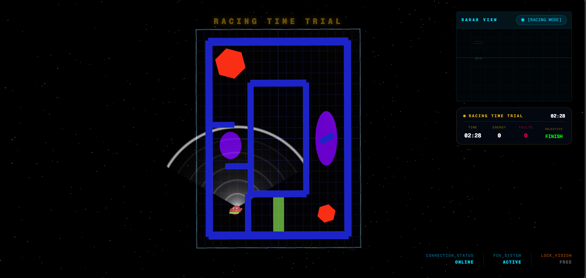

**First to cross the finish line.**

| Detail | Value |
|--------|-------|
| **Players** | 1–4 |
| **Win condition** | Touch the FINISH_LINE obstacle |
| **Obstacles** | SOLID pillars, TRAP mud zones, LAVA corners, One-Way Enforcers |
| **Penalties** | LAVA damage on shortcut attempts |
| **HUD** | Elapsed time, energy consumed, penalty count |

A high-speed time trial circuit through a custom obstacle course. The Racing track features strategic obstacle placement: **One-Way Enforcers** block the wrong direction, **The Weave** forces dodge logic through SOLID pillars, **Mud Traps** slow you by 60%, and **Lava Corners** punish risky shortcuts.

**Strategy tips:**
- `MOVE_FAST` on straights, `MOVE` through The Weave
- Use `PATHFIND` to plan the optimal racing line
- Avoid LAVA corners — the HP loss isn't worth the time save
- `DASH` through Mud Traps to maintain speed

---

### 4. SURVIVAL

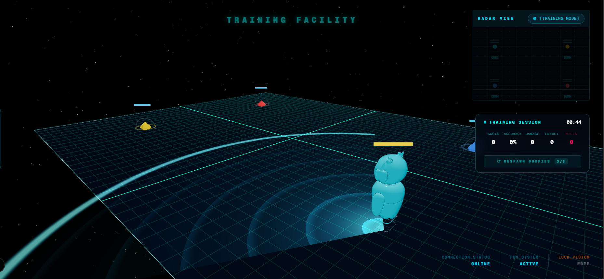

**Outlast the waves.**

| Detail | Value |
|--------|-------|
| **Players** | 1 + waves of enemy bots |
| **Win condition** | Survive all waves |
| **Wave scaling** | Enemies get stronger each wave |
| **Healing** | Per-wave health recovery |
| **HUD** | Current wave, enemies remaining, wave timer |

Enemies spawn dynamically from the match engine (not pre-placed in the lobby) and escalate in difficulty every wave. Early waves test basic combat — later waves demand advanced tactics, energy management, and defensive abilities.

**Strategy tips:**
- Prioritize `SHIELD` and `CLOAK` upgrades for late waves
- Use `MINE` to control enemy approach paths
- `TELEPORT` out of surrounded positions
- Let `STASIS` recharge happen between waves, not during

---

### 5. KING OF THE HILL (KOTH)

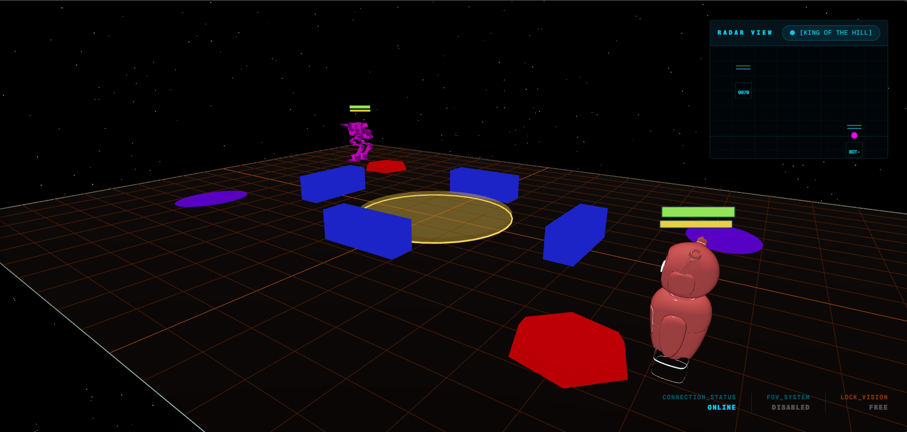

**Control the zone. Dominate the arena.**

| Detail | Value |
|--------|-------|
| **Players** | 2–4 (team or FFA) |
| **Win condition** | First team to score 300 ticks in the zone |
| **Zone location** | Arena center (400, 300) |
| **Zone radius** | 80 units |
| **Fortress walls** | 4 SOLID walls around the zone |

A pulsing amber cylinder glows at the center of the arena. Robots inside the zone earn score ticks for their team. First to 300 wins. Four fortress walls provide cover around the zone, creating natural chokepoints and ambush positions.

**Strategy tips:**
- Hold the zone but don't cluster — spread out behind the fortress walls
- Use `MINE` to secure the zone entrances
- `TAUNT` to pull defenders out of cover
- `CLOAK` to slip into the zone undetected

---

### 6. CAPTURE THE FLAG (CTF)

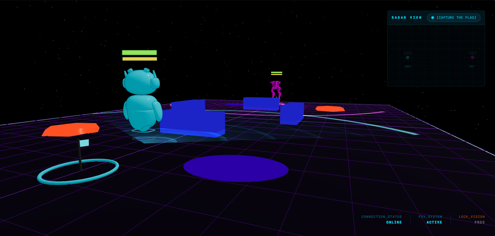

**Steal their flag. Protect yours.**

| Detail | Value |
|--------|-------|
| **Players** | 2–4 (team) |
| **Win condition** | Capture the enemy flag and return it to your base |
| **Flag mechanics** | Flag drops on carrier death, returns to base after 10s |
| **Bases** | One per team, opposite ends of the arena |
| **HUD** | Flag status indicators, capture progress |

The classic team objective mode. Each team has a `CtfBase` at their spawn point and the enemy's `CtfFlag` at theirs. Touch the enemy flag, carry it back to your base, score. If the flag carrier is destroyed, the flag drops and returns to the enemy base after 10 seconds.

**Strategy tips:**
- Designate one robot as the runner (fast, evasive) and one as support
- `CLOAK` the runner for stealth flag grabs
- `MINE` chokepoints near your flag
- `PATHFIND` the safest return route before grabbing

---

### Mode Comparison

| Mode | Players | Win Condition | Duration | Difficulty |
|------|---------|---------------|----------|------------|
| COMBAT | 2–4 | Last alive | ~3 min | ★★☆ |
| TRAINING SOLO | 1 | None (sandbox) | Infinite | ★☆☆ |
| RACING | 1–4 | First to finish | ~2 min | ★★☆ |
| SURVIVAL | 1 | Survive all waves | ~5 min | ★★★ |
| KOTH | 2–4 | 300 zone ticks | ~4 min | ★★☆ |
| CTF | 2–4 | Flag capture | ~5 min | ★★★ |

---

## Play Styles

Three ways to experience Logic Arena. The difference is in **how much you can edit your script during the match**.

---

### 1. CLASSIC

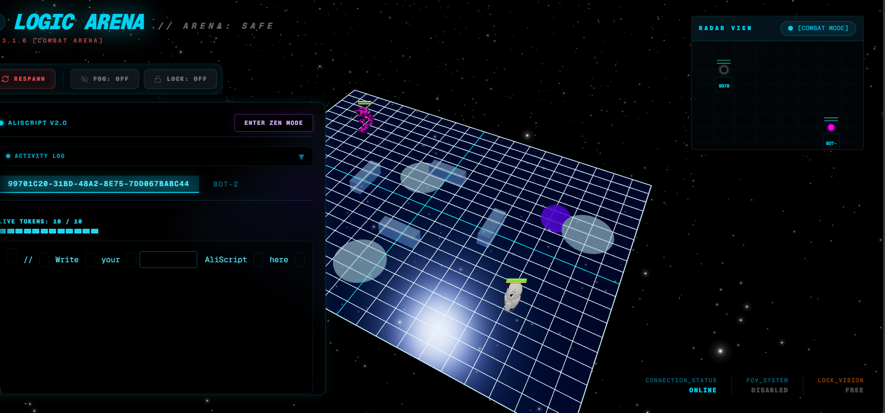

> **Think ahead. Predict your opponent. Plan before you enter.**

**How it works:**
You enter the match with your pre-written AliScript. During the match, you have a strict limit of **10 tokens** for modifications — every word you add or delete costs 1 token.

| Rule | Detail |
|------|--------|
| **Tokens** | 10 per match |
| **Add a word** | Click an empty box between words → type → costs 1 token |
| **Delete a word** | Click any word → whole word is removed → costs 1 token |
| **Select text** | ❌ Not allowed (prevents partial deletions and exploitation) |
| **Tokens exhausted** | You can no longer edit — watch-only mode |

The token system prevents abuse: no selecting parts of words, no deleting characters one by one. Each click on a word removes it entirely and deducts a token. Once your 10 tokens are gone, you're locked into your final script — you can only watch your robot fight with whatever strategy you last set.

> **💡 The philosophy:** CLASSIC mode rewards preparation. You must anticipate your opponent's strategy, plan contingencies, and manage your limited edits wisely. Every change costs you. Make it count.

**Best for:** COMBAT — players who want a test of foresight and preparation.

---

### 2. TACTICAL

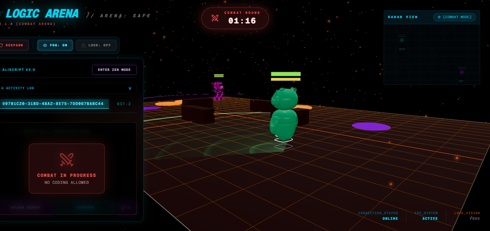

> **Rounds and breaks. Adapt between battles.**

**How it works:**
The match is divided into **rounds** separated by **break periods**. Each round runs on whatever script your robot had when it started. Between rounds, you get a full **60-second break** to freely edit your code with **zero restrictions**.

| Phase | Duration | Editing allowed? |
|-------|----------|------------------|
| **Round 1** | 15 seconds | ❌ No — locked to pre-match script |
| **Break 1** | Up to 60 seconds | ✅ Yes — unrestricted editing |
| **Round 2** | 15 seconds | ❌ No — locked to whatever you saved in Break 1 |
| **Break 2** | Up to 60 seconds | ✅ Yes — unrestricted editing |
| ... | continues until match ends | |

**Early round termination:**
If a robot's HP drops to **50 or below** before the round timer expires, the round ends **immediately** and Break 1 starts. This prevents TACTICAL mode from becoming CLASSIC mode — the whole point is to give the disadvantaged player a chance to adapt and recover.

> **⏳ Break flow:** Both players edit freely. When both press **READY** (or 60 seconds pass), the next round begins automatically.

**The key restriction:** During an active round, NO editing is possible. Your robot fights with whatever script you finalized during the previous break. The tension is in committing to a strategy, watching it play out, then having a full minute to rethink everything before the next round.

**Best for:** All modes — the strategic sweet spot between preparation and adaptation.

---

### 3. HYBRID

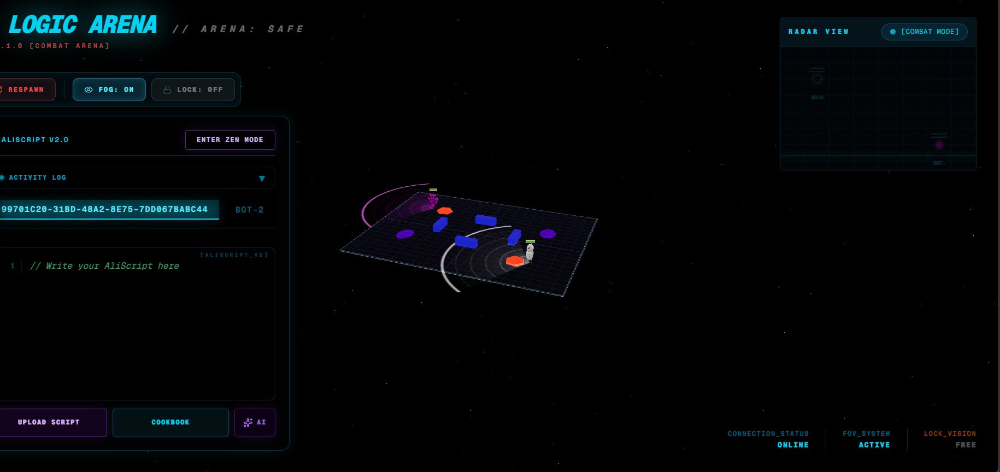

> **The original. Full freedom. No limits.**

**How it works:**
HYBRID is the original/default play style from Logic Arena's launch. You enter the match with your AliScript and can **edit it freely at any time** during the match with **zero restrictions**.

| Feature | Detail |
|---------|--------|
| **Tokens** | Unlimited |
| **Editing during match** | ✅ Yes — unrestricted |
| **Break periods** | None — continuous editing |
| **Round system** | No rounds — single continuous match |

No rounds, no breaks, no token limits. You write your code and iterate live as the match unfolds. If you see your robot making a mistake, you can fix it instantly. If you spot an enemy pattern, you can counter it on the spot.

> **💡 The philosophy:** HYBRID is pure agility and iteration. Your ability to read the battlefield and adapt your script in real time is what separates you from your opponent. No preparation safety net — just you, your code, and the arena.

**Best for:** All modes — the default for players who want maximum control.

---

### Play Style Comparison

| Style | Editing during match | Token limit | Rounds & Breaks | Best for |
|-------|---------------------|-------------|-----------------|----------|
| CLASSIC | Limited | 10 tokens | No | Preparation & foresight |
| TACTICAL | During breaks only | Unlimited (in breaks) | Yes — 15s rounds + 60s breaks | Strategic adaptation |
| HYBRID | Anytime, unrestricted | None | No | Real-time iteration |

---

## Quick Reference

### Environments

| Name | Theme | Special hazard | Risk level |
|------|-------|----------------|------------|
| NEO-CYBER | Cyberpunk neon | Standard lava (5 HP/s) | Low |
| MAGMA CORE | Volcanic lava | Dynamic lava pools (10 HP/s) | Medium |
| GLACIAL TUNDRA | Arctic ice | ICE_PATCH sliding | High |

### Modes

| Mode | Type | Key skill |
|------|------|-----------|
| COMBAT | PvP | Combat targeting |
| TRAINING SOLO | Practice | Script iteration |
| RACING | Time trial | Path optimization |
| SURVIVAL | PvE | Resource management |
| KOTH | Zone control | Positioning |
| CTF | Team objective | Coordination |

### Play Styles

| Style | Philosophy |
|-------|------------|
| CLASSIC | 10 tokens — every edit costs you. Think before you write. |
| TACTICAL | Rounds + breaks — adapt between battles, commit during them. |
| HYBRID | Full freedom — edit anytime, iterate live. |

---

> **Next steps:** Head to the [AliScript Language Guide](aliscript-language.md) to learn how to command your robot, or jump into the [Game Rules](game-rules.md) for the full mechanics reference.
