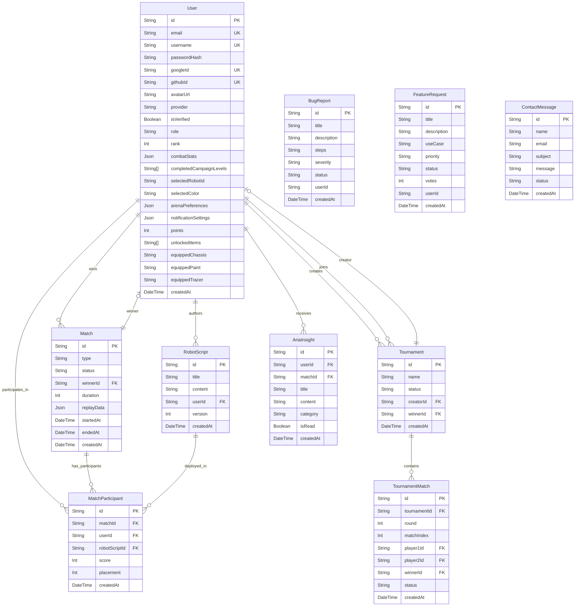

# ERD Diagram (Logic Arena)

Below is the Entity-Relationship Diagram outlining the current PostgreSQL database schema, managed by Prisma ORM.

## Schema Highlights

* **Auth & Profiles**: Supports both Local and OAuth (Google/GitHub). Profile configurations including colors and preferences are stored as JSON strings.
* **MatchParticipants**: A junction table linking a specific `User`, `Match`, and `RobotScript` version to track exact combat metrics per match.
* **Economy (Black Market)**: `points` and `unlockedItems` fields manage user progression and unlocks.
* **Admin / Support**: `BugReport`, `FeatureRequest`, and `ContactMessage` handle user support workflows and feedback hub tracking.