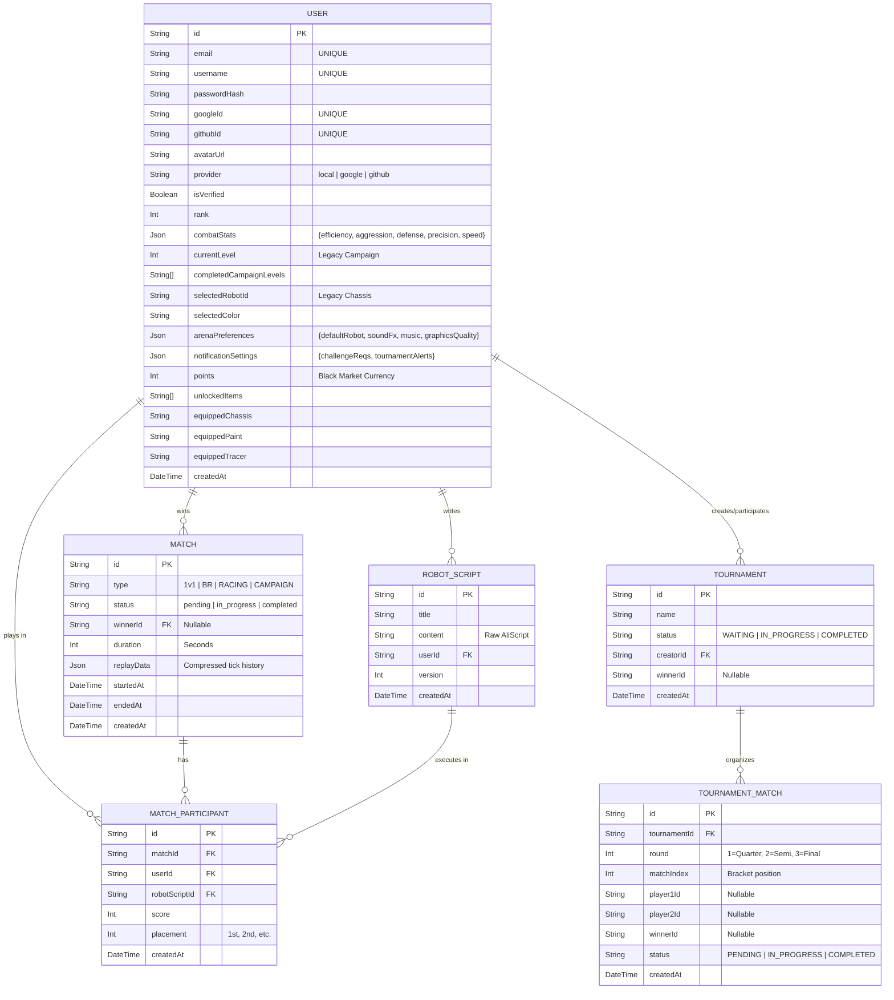

# Entity Relationship Diagram (ERD)

This document maps the entire PostgreSQL schema utilized by the Logic Arena backend via Prisma ORM.

## Schema Highlights

### Player Identity & Black Market
The `USER` model contains extensive metadata, including Cloudinary avatar URLs, OAuth IDs, and JSON blocks for `combatStats`, `arenaPreferences`, and `notificationSettings`. It natively handles Black Market progression (`points`, `unlockedItems`, `equippedChassis`).

### Match History & Telemetry
Every arena encounter is tracked via the `MATCH` and `MATCH_PARTICIPANT` junction table. Scripts executed during a match are hard-linked (`robotScriptId`) so players can analyze exactly which code payload resulted in a win or loss. Telemetry is saved to `replayData` for the post-game 2D canvas viewer.

### Tournaments
The `TOURNAMENT` and `TOURNAMENT_MATCH` tables support dynamic, n-player recursive bracket generation, mapping the progression of players through quarter-finals to the championship match.