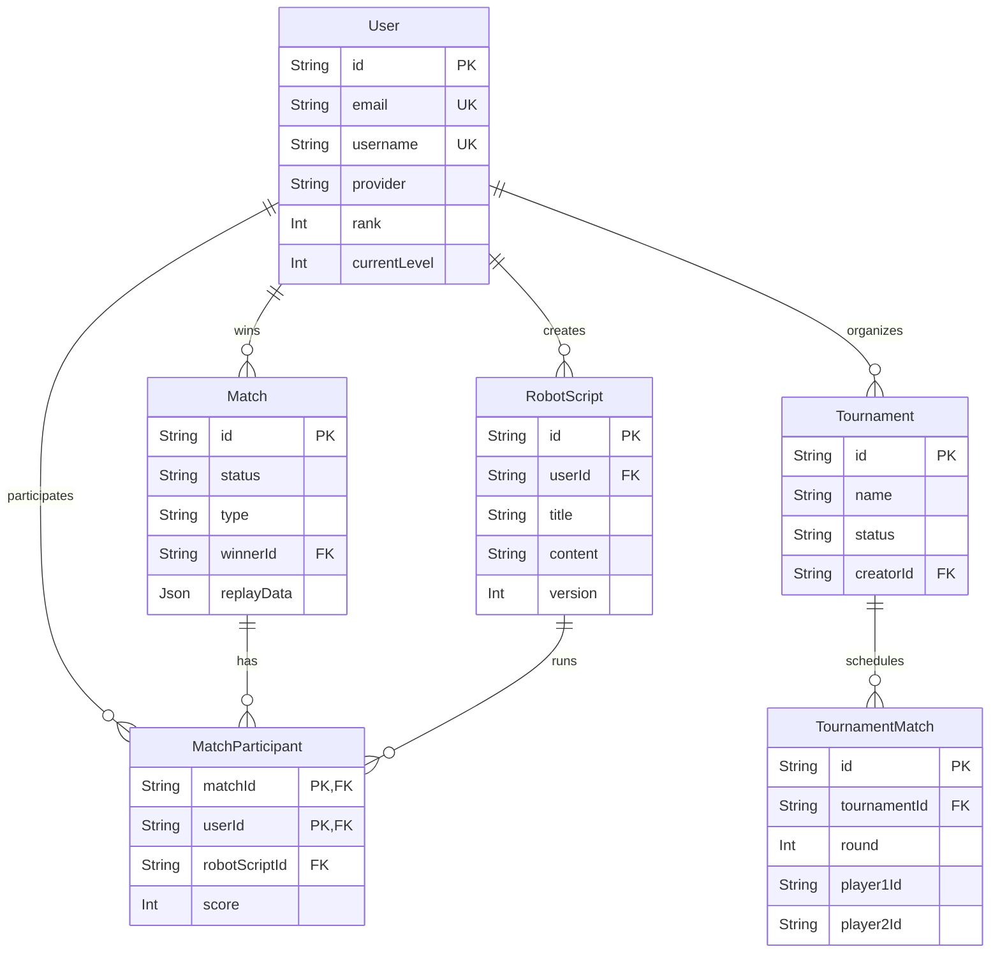

# Entity Relationship Diagram (ERD) (v2.2.0)

## Entities:

### User
*   `id` (PK, String, UUID)
*   `email` (String, Unique)
*   `username` (String, Unique)
*   `passwordHash` (String, Nullable)
*   `googleId` (String, Unique, Nullable)
*   `githubId` (String, Unique, Nullable)
*   `avatarUrl` (String, Nullable)
*   `provider` (String, Nullable) — 'local', 'google', 'github'
*   `isVerified` (Boolean)
*   `verifyCode` / `verifyExpiry` (String / DateTime, Nullable)
*   `resetCode` / `resetExpiry` (String / DateTime, Nullable)
*   `rank` (Integer)
*   `currentLevel` (Integer)
*   `selectedRobotId` (String)
*   `selectedColor` (String)
*   `createdAt` (Timestamp)

### RobotScript
*   `id` (PK, String, UUID)
*   `title` (String)
*   `content` (Text)
*   `userId` (FK to User.id)
*   `version` (Integer)
*   `createdAt` (Timestamp)

### Match
*   `id` (PK, String, UUID)
*   `type` (String)
*   `status` (String) — 'pending', 'in_progress', 'completed'
*   `winnerId` (FK to User.id, Nullable)
*   `duration` (Integer)
*   `replayData` (JSON, Nullable)
*   `startedAt` (Timestamp, Nullable)
*   `endedAt` (Timestamp, Nullable)
*   `createdAt` (Timestamp)

### MatchParticipant
*   `id` (PK, String, UUID)
*   `matchId` (FK to Match.id)
*   `userId` (FK to User.id)
*   `robotScriptId` (FK to RobotScript.id)
*   `score` (Integer)
*   `placement` (Integer, Nullable)
*   `createdAt` (Timestamp)

### Tournament
*   `id` (PK, String, UUID)
*   `name` (String)
*   `status` (String) — 'WAITING', 'IN_PROGRESS', 'COMPLETED'
*   `creatorId` (FK to User.id)
*   `winnerId` (String, Nullable)
*   `createdAt` (Timestamp)

### TournamentMatch
*   `id` (PK, String, UUID)
*   `tournamentId` (FK to Tournament.id)
*   `round` (Integer)
*   `matchIndex` (Integer)
*   `player1Id` (String, Nullable)
*   `player2Id` (String, Nullable)
*   `winnerId` (String, Nullable)
*   `status` (String) — 'PENDING', 'IN_PROGRESS', 'COMPLETED'
*   `createdAt` (Timestamp)

## Relationships:

*   **User -- RobotScript:** 1-to-Many
*   **User -- Match (Winner):** 1-to-Many
*   **User -- MatchParticipant:** 1-to-Many
*   **Match -- MatchParticipant:** 1-to-Many
*   **MatchParticipant -- RobotScript:** 1-to-1 association mapped internally 
*   **User -- Tournament (Creator):** 1-to-Many
*   **Tournament -- TournamentMatch:** 1-to-Many

## Diagram:

