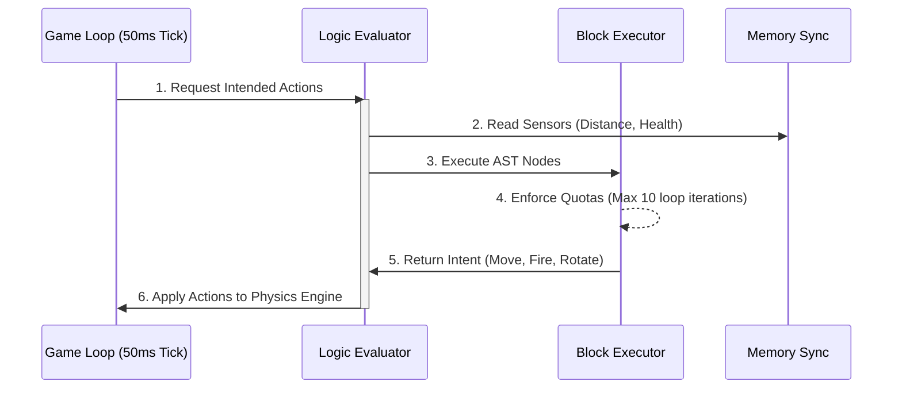

# Script Sandboxing (Server-Side Evaluator Pipeline)

To safely execute user-provided code continuously at 20 ticks per second, Logic Arena utilizes a bespoke AST (Abstract Syntax Tree) execution pipeline. This system runs natively within the NestJS backend, completely avoiding dangerous functions like `eval()` or unreliable virtual machines like `vm2`.

## AST Evaluator Architecture

The parser (`packages/logic-parser`) breaks AliScript syntax cleanly into strongly-typed, predictable nodes (`AstNode`). The backend's `evaluator/` module reconstructs this pipeline deterministically without ever exposing the underlying Node.js V8 execution context to the user.

### 1. `LogicFacade` & `ExpressionFacade`
The evaluation boundaries are strictly decoupled. General structural blocks (like `IF`, `WHILE`, and variable assignments) are handled by the `LogicFacade`. Mathematical operations, distance lookups, and boolean comparisons (`+`, `-`, `>`, `AND`) evaluate deterministically through the `ExpressionFacade`.

### 2. `BlockExecutor` (The Loop Guard)
Because AliScript is Turing-complete, users can accidentally (or maliciously) write infinite loops:
```text
WHILE 1 > 0 DO
  MOVE
END
```
All execution flows through the `BlockExecutor`. The executor tracks the number of instructions processed during the current tick and actively monitors block lengths to prevent catastrophic CPU spikes.

## Execution Constraints & Limits

* **Time Limit Exceeded (TLE) Quotas:** To prevent infinite `WHILE` loops from crashing the main physical game loop, the sandbox hardcaps iteration cycles. The engine restricts scripts to a maximum of **10 loop iterations per tick**.
* **Graceful Halting:** If a script exceeds its quota, the `BlockExecutor` silently halts the script's evaluation for the remainder of that 50ms tick. The engine immediately applies whatever intent the robot successfully computed before halting, and the script seamlessly resumes evaluation on the *next* tick.
* **Strict Memory Isolation:** Scripts interact exclusively via a rigid dictionary array (`memory-sync.ts`). Local variables are isolated deterministically. Cross-robot data leakage or memory contamination is structurally impossible.

## The 50ms Evaluation Pipeline

1. **Parsing Phase:** When a user updates their script in the Dashboard, the `logic-parser` converts the raw text into a static AST JSON payload. This payload is stored securely in PostgreSQL.
2. **Match Initialization:** The match orchestrator retrieves the AST and hydrates independent `LogicEvaluator` instances for each robot participating in the match.
3. **Tick Evaluation:** Every 50ms, the engine loops through active evaluators, requesting a state mutation vector:
   * The evaluator traverses its AST.
   * It maps requested outputs (e.g., `FIRE`, `MOVE_FAST`) into a hardware physics intent buffer.
   * The engine applies these intents deterministically across the spatial grid.

