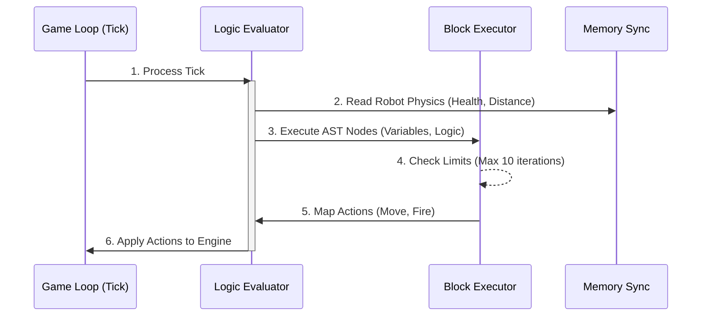

# Script Sandboxing (Server-side Evaluator Pipeline)

To safely execute user-provided robot scripts continuously, a bespoke AST (Abstract Syntax Tree) execution pipeline has been designed running on the NestJS backend natively securely isolating logic constraints directly into explicit domain bounds avoiding flawed `eval` vulnerabilities universally.

## AST Evaluator Architecture

Instead of leveraging generic process managers, our parser breaks AliScript syntax cleanly into strongly-typed nodes (`AstNode`). The `evaluator/` module reconstructs this pipeline deterministically without risking native JS scope injection securely.

### 1. `LogicFacade` & `ExpressionFacade`
The structural boundaries are split. General structural blocks (`IF`, `WHILE`, Assignments) are handled dynamically by the `LogicFacade`, whereas mathematical operations (`+`, `-`, `>`, `AND`) evaluate correctly through the `ExpressionFacade`.

### 2. `BlockExecutor` (The Loop Guard)
All execution lists flow precisely through the `BlockExecutor`. Because user commands can loop infinitely, the executor actively monitors block lengths natively blocking catastrophic execution spikes securely correctly gracefully.

## Execution Constraints & Security Limits

*   **Iteration limits:** To prevent infinite `WHILE` loops crashing the physical game loop, the sandbox hardcaps iteration cycles to **10 iterations per tick max**. Exceeding this silently halts the loop execution for the remainder of the active tick, resuming cleanly perfectly sequentially later gracefully natively.
*   **Memory Sync:** Scripts interact exclusively via a rigid dictionary array (`memory-sync.ts`). Local variables are isolated deterministically securely explicitly preventing cross-robot data leakage organically completely strictly.

## Communication Flow

1.  **Parsing Phase:** Upon script update via Dashboard, the `logic-parser` converts text natively generating static AST JSON. 
2.  **Match Start:** The backend game orchestrator hydrates individual `LogicEvaluator` instances assigning independent ASTs cleanly explicitly towards target Robots natively successfully structurally logically correct efficiently globally.
3.  **Tick Evaluation:** Every frame, the engine loops through active evaluators natively requesting a state mutation vector synchronously.
    *   The evaluator traverses its AST correctly mapping outputs cleanly dynamically converting state actions (e.g. `FIRE`) towards hardware physics natively mapping gracefully completely logically safely.

